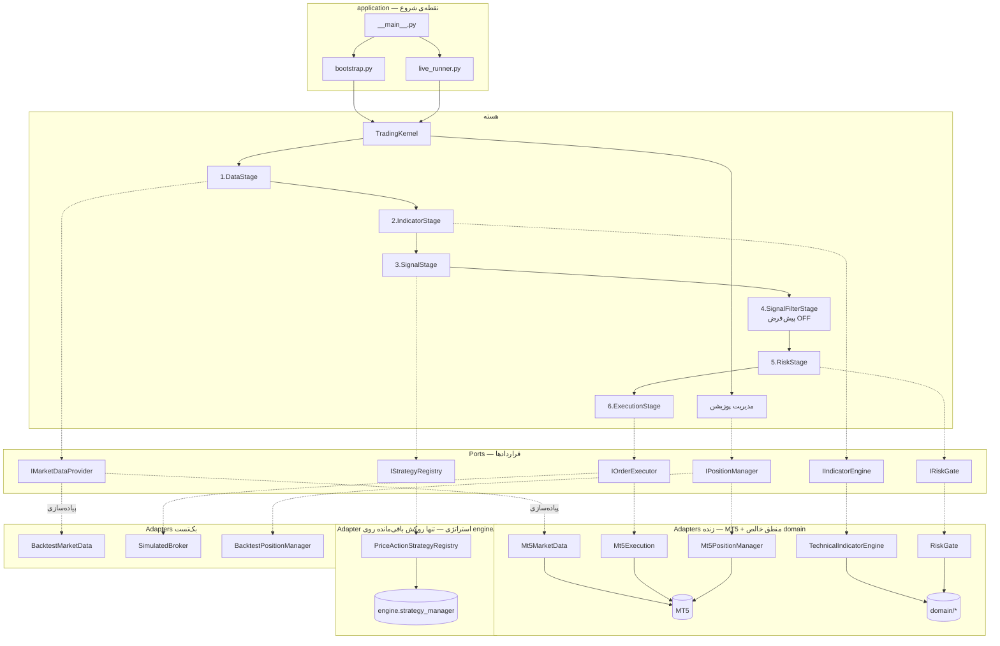
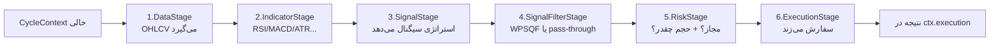

# راهنمای کامل توسعه‌دهنده — TradingBot (نسخه بازطراحی)

> این فایل برای برنامه‌نویسی نوشته شده که تازه به پروژه اضافه می‌شود. هدف: از صفر تا صد بفهمی
> ربات چطور کار می‌کند، از چه اجزایی ساخته شده، و با چه دستوراتی اجرا می‌شود — بدون گیج‌شدن.
> پیشنهاد می‌کنم **به ترتیب** بخوانی؛ هر بخش روی بخش قبلی ساخته شده.

فهرست:
1. [این ربات چیست؟](#۱-این-ربات-چیست)
2. [فلسفه‌ی معماری (مهم‌ترین بخش)](#۲-فلسفهی-معماری)
3. [نقشه‌ی کلی در یک نگاه](#۳-نقشهی-کلی-در-یک-نگاه)
4. [ساختار پوشه‌ها](#۴-ساختار-پوشهها)
5. [۷ مفهوم کلیدی](#۵-هفت-مفهوم-کلیدی)
6. [جریان یک معامله — قدم‌به‌قدم](#۶-جریان-یک-معامله-قدمبهقدم)
7. [حالت‌های اجرا و دستورات](#۷-حالتهای-اجرا-و-دستورات)
8. [اجزا به‌تفصیل](#۸-اجزا-بهتفصیل)
9. [مدیریت پوزیشن](#۹-مدیریت-پوزیشن)
10. [پکیج engine/ — چه چیزی باقی مانده](#۱۰-پکیج-engine-چه-چیزی-باقی-مانده)
11. [زیرسیستم بک‌تست](#۱۱-زیرسیستم-بکتست)
12. [چطور توسعه بدهیم](#۱۲-چطور-توسعه-بدهیم)
13. [تست و اعتبارسنجی](#۱۳-تست-و-اعتبارسنجی)
14. [وضعیت فعلی و راه‌اندازی محیط](#۱۴-وضعیت-فعلی-و-راهاندازی-محیط)
15. [واژه‌نامه](#۱۵-واژهنامه)
16. [روز اول: از کجا شروع کن](#۱۶-روز-اول-از-کجا-شروع-کن)

---

## ۱) این ربات چیست؟

یک ربات معامله‌گر خودکار برای **MetaTrader 5 (MT5)**. کارش این است:

> هر چند ثانیه یک‌بار، داده‌ی بازار را می‌گیرد → اندیکاتور حساب می‌کند → استراتژی سیگنال
> می‌دهد → ریسک را می‌سنجد → در صورت تأیید سفارش می‌زند → پوزیشن‌های باز را مدیریت می‌کند
> (تریلینگ استاپ، برداشت سود پله‌ای، حد ضرر اضطراری).

پیشینه: یک پروژه‌ی قدیم `TradingBot/` وجود داشت با منطق درهم‌تنیده. این پروژه (`TradingBot new/`)
یک **بازطراحی معماری مستقل** است. در ابتدا منطق ارزشمند قدیم به پکیج داخلی `engine/` منتقل شد و
سپس **گام‌به‌گام به ماژول‌های تمیز و مستقل در `tradingbot/` بازنویسی شد**.

وضعیت امروز (مهم):
- **اندیکاتورها، ریسک، داده، اجرا، لاگ‌گیری، پیکربندی و سرویس‌های پس‌زمینه** همگی بازنویسی شده و
  به‌صورت ماژول‌های تمیز در `tradingbot/` زندگی می‌کنند.
- از پکیج `engine/` تنها **استراتژی Price Action** (`priceaction`) باقی مانده است.
- ربات **تخصصی طلا** است: منطقی `XAUUSD`؛ نماد بروکر live **`XAUUSD_i`** via `adapters/symbols.py` (identity/economics **NOT PROVEN** equivalent to bare `XAUUSD`). پریست‌های per-TF برای `M5/M15/H4` در `pa_symbol_tf_presets.py`؛ **چرخه live پیش‌فرض فقط M5** (`get_live_config()` وقتی router روشن است). *(به‌روزرسانی شده — وضعیت واقعی کد در تاریخ 2026-09-10)*
- مسیر سیگنال یکپارچه در `domain/signal_helpers.py` (لایه میانی).
- پروژه کاملاً **خودکفا** است؛ هیچ ارجاعی به پروژه‌ی قدیمِ بیرونی ندارد.

---

## ۲) فلسفه‌ی معماری

### مشکل پروژه‌ی قدیم
در پروژه‌ی قدیم، منطق در فایل‌های غول‌پیکر پراکنده بود (`trading_bot.py`، `system_manager.py`، …).
داده، سیگنال، ریسک، سفارش، و مدیریت پوزیشن در هم تنیده بودند. تست‌کردن، تغییردادن، یا
بک‌تست‌گرفتن سخت بود چون همه‌چیز به MT5 و به هم گره خورده بود.

### راه‌حل: هسته‌ی مرکزی + Ports & Adapters
دو ایده‌ی ساده ولی قدرتمند:

**ایده‌ی ۱ — همه‌چیز از یک «هسته» عبور می‌کند.**
یک کلاس به نام `TradingKernel` تنها هماهنگ‌کننده است. منطق معامله یک **خط لوله (pipeline)**
ثابت با **۶ مرحله** است *(به‌روزرسانی شده — وضعیت واقعی کد در تاریخ 2026-09-10)*:

```
داده → اندیکاتور → سیگنال → فیلتر سیگنال (SignalFilter؛ پیش‌فرض OFF) → ریسک → اجرا
```

`SignalFilterStage` همیشه در زنجیره ثبت است (`trading_kernel.py`)؛ رفتار WPSQF فقط وقتی
`TRADINGBOT_SIGNAL_FILTER=WPSQF` روشن می‌شود، وگرنه pass-through است.

**ایده‌ی ۲ — Ports & Adapters (معماری شش‌ضلعی).**
هسته با دنیای بیرون فقط از طریق **قرارداد (Port)** حرف می‌زند، نه پیاده‌سازی مشخص.

- **Port** = یک interface (در پایتون: `Protocol`). مثلاً «منبع داده» یا «اجراکننده‌ی سفارش».
- **Adapter** = پیاده‌سازی واقعی آن قرارداد. مثلاً «منبع داده‌ی MT5» یا «منبع داده‌ی بک‌تست».

**چرا این عالی است؟** چون می‌توانی بدون دست‌زدن به هسته، پیاده‌سازی‌ها را عوض کنی:

| Port | Adapter زنده (Live) | Adapter بک‌تست |
|------|----------------------|----------------|
| منبع داده | داده از MT5 | داده‌ی تاریخی از فایل |
| اجرای سفارش | سفارش واقعی به MT5 | بروکر شبیه‌سازی‌شده |

> تمثیل ساده: هسته مثل یک «مدیر» است که فقط دستور می‌دهد «داده بیار»، «سفارش بزن».
> برایش مهم نیست داده از MT5 می‌آید یا از فایل تاریخی — فقط با قرارداد کار می‌کند.
> همین باعث می‌شود **بک‌تست و معامله‌ی واقعی، دقیقاً همان کد هسته را اجرا کنند.**

### الگوی بازنویسی (domain + adapter)
هر ماژولی که بازنویسی شد، طبق همین قاعده تقسیم شد:
- **منطق خالص** (بدون I/O و بدون MT5) در `domain/` — قابل تست، قطعی. مثل
  `domain/indicators.py`، `domain/risk_logic.py`، `domain/order_logic.py`.
- **آداپتر** که آن منطق را به یک Port وصل می‌کند. مثل `adapters/indicator_engine.py`،
  `adapters/risk_gate.py`، `adapters/mt5_execution.py`.

---

## ۳) نقشه‌ی کلی در یک نگاه



---

## ۴) ساختار پوشه‌ها

```
TradingBot new/
├── tradingbot/                  ← بسته‌ی اصلی پایتون
│   ├── __main__.py              ← نقطه‌ی ورود CLI (python -m tradingbot ...)
│   │
│   ├── kernel/
│   │   └── trading_kernel.py    ← ❤️ هسته: orchestration کل چرخه
│   │
│   ├── pipeline/                ← ۶ مرحله‌ی پردازش (هرکدام یک مسئولیت؛ SignalFilter پیش‌فرض OFF)
│   │   ├── base.py              ← کلاس پایه‌ی PipelineStage
│   │   ├── data_stage.py        ← ۱) بارگذاری OHLCV
│   │   ├── indicator_stage.py   ← ۲) افزودن اندیکاتور
│   │   ├── signal_stage.py      ← ۳) تولید سیگنال
│   │   ├── signal_filter_stage.py ← ۴) فیلتر کیفیت (WPSQF؛ flag-gated)
│   │   ├── risk_stage.py        ← ۵) بررسی ریسک + اندازه‌ی حجم
│   │   └── execution_stage.py   ← ۶) ارسال سفارش
│   │
│   ├── ports/                   ← 📜 قراردادها (Protocolها) — صرفاً interface
│   │   ├── market_data.py        ├ indicators.py    ├ strategies.py
│   │   ├── risk.py               ├ execution.py     ├ position_manager.py
│   │   └── events.py             └ storage.py
│   │
│   ├── adapters/                ← 🔌 پیاده‌سازی‌های واقعی portها
│   │   ├── mt5_market_data.py        ← داده از MT5 (خودکفا: copy_rates + کش parquet)
│   │   ├── mt5_execution.py          ← سفارش به MT5 (خودکفا: order_send مستقیم)
│   │   ├── mt5_position_manager.py   ← مدیریت پوزیشن روی MT5
│   │   ├── indicator_engine.py       ← TechnicalIndicatorEngine (روی domain/indicators)
│   │   ├── risk_gate.py              ← RiskGate + create_risk_gate (روی domain/risk_logic)
│   │   ├── legacy_strategy_registry.py ← PriceActionStrategyRegistry (روی engine.strategy_manager)
│   │   ├── background_services.py    ← مدیریت start/stop سرویس‌های پس‌زمینه (services/)
│   │   ├── market_cache.py           ← کش parquet داده‌ی بازار
│   │   ├── mt5_utils.py              ← استخراج اعتبارنامه‌ی MT5 از config
│   │   ├── legacy_loader.py          ← بارگذاری/ادغام config (بخش ۱۰)
│   │   ├── legacy_signal_helpers.py  ← re-export از signal_helpers (سازگاری)
│   │   ├── symbols.py / timeframes.py ← تبدیل نماد/تایم‌فریم (XAUUSD → XAUUSD_i)
│   │   └── stubs.py                  ← پیاده‌سازی‌های قلابی برای دمو بدون MT5
│   │
│   ├── domain/                  ← 🧮 منطق و مدل‌های خالص (بدون I/O، قابل تست)
│   │   ├── models.py            ← MarketKey, TradingSignal, RiskDecision, CycleContext...
│   │   ├── enums.py             ← SignalDirection, KernelState, PipelineStageName...
│   │   ├── signal_helpers.py    ← ★ لایه میانی: resolve_market → confidence → SL/TP → TradingSignal
│   │   ├── price_action.py      ← SMC: swing, BOS, FVG, setup evaluation
│   │   ├── position_logic.py    ← trailing/partial/pip (مشترک live+backtest)
│   │   ├── indicators.py        ← RSI/MACD/ATR/...
│   │   ├── risk_logic.py        ← sizing/gating ریسک
│   │   ├── order_logic.py       ← اعتبارسنجی سفارش
│   │   ├── session_logic.py     ← فیلتر سشن، spread، جمعه/EOD
│   │   └── ohlcv.py             ← نرمال‌سازی OHLCV
│   │
│   ├── infra/                   ← زیرساخت خنثی
│   │   └── logging.py           ← get_logger تمیز (جایگزین engine.logger)
│   │
│   ├── services/               ← سرویس‌های پس‌زمینه‌ی مستقل (MT5)
│   │   ├── kill_switch.py             ← توقف اضطراری (drawdown / ضرر روزانه)
│   │   ├── position_protector.py        ← محافظت/تریلینگ در thread جدا (پیش‌فرض خاموش)
│   │   └── position_recovery_service.py ← بازیابی پوزیشن پس از restart (sqlite)
│   │
│   ├── config/
│   │   ├── settings.py          ← KernelSettings (تنظیمات هسته)
│   │   ├── strategies.py        ← ACTIVE_STRATEGIES (فقط priceaction=True)
│   │   ├── price_action.py      ← پایه PA + get_price_action_config()
│   │   ├── pa_symbol_tf_presets.py ← ★ پریست per-TF برای XAUUSD (M5/M15/H4)
│   │   ├── legacy_settings.py   ← تبدیل config → KernelSettings
│   │   ├── engine_settings.py   ← config پایه
│   │   └── live.py              ← config معاملات live
│   │
│   ├── application/             ← سیم‌کشی و اجرا
│   │   ├── bootstrap.py         ← ساخت kernel (demo/live/strategies) + یک‌چرخه
│   │   └── live_runner.py       ← حلقه‌ی دائمی live + خاموشی امن
│   │
│   └── backtest/                ← 📊 زیرسیستم بک‌تست (بخش ۱۱)
│       ├── engine.py            ← موتور: kernel را کندل‌به‌کندل اجرا می‌کند
│       ├── data_source.py       ← منبع داده‌ی تاریخی
│       ├── broker.py            ← بروکر شبیه‌سازی‌شده
│       ├── risk.py / position_manager.py / indicators.py
│       ├── metrics.py           ← محاسبه‌ی متریک (win rate, profit factor, ...)
│       ├── models.py / config.py
│
├── engine/                      ← فقط استراتژی‌ها + پشتیبانی کوچک (بخش ۱۰)
│   ├── strategy_manager.py      ← بارگذاری/اجرای استراتژی‌ها
│   ├── strategies/              ← price_action_strategy / base_strategy
│   ├── logger.py                ← لاگرِ قدیمِ مورد استفاده‌ی همین استراتژی‌ها
│   └── config.py                ← shim نازک → tradingbot.config.engine_settings
│
├── scripts/                     ← ابزارهای اجرا و تحقیق
│   ├── run_backtest.py              ← بک‌تست عمومی
│   ├── run_live_watchdog.py         ← LIVE + ری‌استارت خودکار
│   ├── backtest_custom_range.py     ← بک‌تست بازهٔ تهران (پنل HTA)
│   ├── train_meta_labeler.py        ← آموزش meta-labeler
│   ├── show_meta_stats.py           ← گزارش OOS meta
│   ├── check_live_setup.py          ← چک قبل از live
│   ├── run_backtest.py              ← بک‌تست عمومی
│   ├── run_gold_pa_research_tune.py ← تحقیق ۷ پریست
│   ├── run_pa_tune.py               ← واریانت‌های tune (وابستگی matrix)
│   └── check_live_setup.py          ← چک قبل از live
│
├── docs/                        ← مستندات فارسی (همین فایل اینجاست)
├── data/                        ← کش parquet + position_state.db
└── reports/                     ← خروجی JSON بک‌تست‌های طلا
```

---

## ۵) هفت مفهوم کلیدی

این هفت اصطلاح را بفهمی، ۸۰٪ پروژه را فهمیده‌ای:

| # | مفهوم | یعنی چه |
|---|-------|---------|
| ۱ | **Kernel (هسته)** | تنها کلاسی که چرخه را هماهنگ می‌کند. `TradingKernel`. خودش هیچ منطق استراتژی ندارد. |
| ۲ | **Pipeline / Stage** | زنجیره‌ی **۶** مرحله‌ای پردازش (شامل `SignalFilterStage` پیش‌فرض OFF). هر مرحله یک کلاس `PipelineStage` با یک متد `run()`. |
| ۳ | **Port** | قرارداد (interface/`Protocol`). می‌گوید «چه کاری» باید انجام شود، نه «چطور». |
| ۴ | **Adapter** | پیاده‌سازی واقعی یک Port. سه دسته: `mt5_*` (زنده)، آداپترهای روی `domain/*` (تمیز)، و `backtest/*` (شبیه‌سازی). تنها یک روکش روی `engine/` مانده: `legacy_strategy_registry`. |
| ۵ | **Domain** | منطق و مدل‌های خالص (بدون I/O). هم ساختار داده (`TradingSignal`) و هم محاسبات (اندیکاتور/ریسک/سفارش). |
| ۶ | **CycleContext** | یک «جعبه» که در طول pipeline دست‌به‌دست می‌شود و هر مرحله چیزی به آن اضافه می‌کند (داده → سیگنال → تصمیم ریسک → نتیجه‌ی اجرا). |
| ۷ | **dry-run** | حالت «بدون ارسال سفارش واقعی». با متغیر محیطی `TRADINGBOT_DRY_RUN=1`. برای تست امن. |

### CycleContext دقیقاً چیست؟
موقع پردازش هر بازار، یک `CycleContext` ساخته می‌شود و از مرحله‌ای به مرحله‌ی بعد می‌رود.
هر مرحله یک فیلد آن را پر می‌کند:

```python
@dataclass
class CycleContext:
    market: MarketKey                # کدام نماد:تایم‌فریم
    raw_ohlcv: pd.DataFrame | None    # مرحله ۱ پر می‌کند
    enriched_ohlcv: pd.DataFrame | None  # مرحله ۲ (با اندیکاتور)
    signal: TradingSignal | None      # مرحله ۳؛ مرحله ۴ (SignalFilter) ممکن است آن را None کند
    risk: RiskDecision | None         # مرحله ۵
    execution: ExecutionResult | None # مرحله ۶
    errors: list[str]                 # هر خطایی اینجا ثبت می‌شود
```

اگر مرحله‌ای `False` برگرداند (مثلاً سیگنالی نبود یا ریسک رد کرد)، pipeline همان‌جا برای این
بازار **متوقف** می‌شود و سراغ بازار بعدی می‌رود.

---

## ۶) جریان یک معامله — قدم‌به‌قدم

دو سطح چرخه داریم:

### `run_global_cycle()` — یک «تیک» کامل سیستم
در `trading_kernel.py`. این کارها را انجام می‌دهد:

```
۱) اتصال MT5 را بررسی کن (ensure_connected)
۲) داده‌ی همه‌ی نمادها را به‌روزرسانی کن (update_all)
۳) snapshot پورتفولیو بگیر (بالانس، پوزیشن‌های باز)
۴) برای هر «بازار» (نماد×تایم‌فریم؛ پیش‌فرض live فقط `XAUUSD_i:5m`):
       run_market_cycle(market)   ← همان pipeline ۶ مرحله‌ای
۵) مدیریت پوزیشن‌های باز (trailing/partial/emergency)  ← یک‌بار در پایان
```

### `run_market_cycle(market)` — pipeline ۶ مرحله‌ای برای یک بازار



جزئیات هر مرحله:

| مرحله | فایل | ورودی | خروجی | چه زمانی متوقف می‌شود |
|-------|------|-------|--------|------------------------|
| **۱ DataStage** | `data_stage.py` | بازار | `raw_ohlcv` (≥۱۰۰ کندل) | داده کم باشد |
| **۲ IndicatorStage** | `indicator_stage.py` | `raw_ohlcv` | `enriched_ohlcv` | — |
| **۳ SignalStage** | `signal_stage.py` → `legacy_strategy_registry` → `signal_helpers` | `enriched_ohlcv` | `signal` | سیگنال HOLD/None یا confidence پایین |
| **۴ SignalFilterStage** | `signal_filter_stage.py` | `signal` | همان / None | وقتی WPSQF روشن است و امتیاز کافی نیست؛ پیش‌فرض OFF → همیشه pass |
| **۵ RiskStage** | `risk_stage.py` | `signal`+snapshot | `risk` + `lot_size` | ریسک رد کند |
| **۶ ExecutionStage** | `execution_stage.py` | `signal`+`lot` | `execution` | اجرا ناموفق باشد |

> مثال واقعی: برای `XAUUSD:M5`، اگر استراتژی سیگنال BUY با confidence 0.75 بدهد و ریسک
> اجازه دهد و حجم 0.02 لات حساب کند، مرحله‌ی ۶ سفارش BUY با 0.02 لات می‌زند (یا در dry-run
> فقط لاگ می‌کند).

---

## ۷) حالت‌های اجرا و دستورات

همه از طریق `python -m tradingbot` در ریشه‌ی پروژه:

```powershell
cd "c:\Users\AMIR\Desktop\TradingBot new"
```

| دستور | چه می‌کند | MT5 لازم؟ |
|-------|-----------|-----------|
| `python -m tradingbot` | دموی ساده با داده‌ی قلابی (stub) — برای دیدن سریع pipeline | ❌ |
| `python -m tradingbot --strategies` | استراتژی‌های **واقعی** روی داده‌ی قلابی | ❌ |
| `python -m tradingbot --live` | یک چرخه‌ی واقعی با MT5 (پیش‌فرض dry-run، سفارش نمی‌زند) | ✅ |
| `python -m tradingbot --live --execute` | یک چرخه با **سفارش واقعی** | ✅ |
| `python -m tradingbot --loop` | حلقه‌ی دائمی (هر ۳۰–۶۰ ثانیه)، dry-run | ✅ |
| `python -m tradingbot --loop --paper` | حلقه با **paper mode**: تیک واقعی + پر کردن شبیه‌سازی + journal | ✅ |
| `python -m tradingbot --loop --execute` | حلقه‌ی دائمی با **سفارش واقعی** (Ctrl+C برای توقف امن) | ✅ |
| `python -m tradingbot --backtest --symbol XAUUSD --tf M15 --bars 1500` | بک‌تست | ✅ (برای دریافت داده) |

فلگ‌های کمکی:
- `--execute` : فعال‌کردن سفارش واقعی (بدون آن = dry-run امن).
- `--paper` : paper mode — بدون سفارش بروکر؛ slippage و معاملات در `data/trade_journal.db` ثبت می‌شوند.
- `--protector` : فعال‌کردن `PositionProtector` (پیش‌فرض خاموش، چون هسته خودش پوزیشن را مدیریت می‌کند).
- `--no-recovery` : خاموش‌کردن سرویس بازیابی پوزیشن.

**سه حالت اجرا** (`services/execution_mode.py`):

| حالت | env | سفارش بروکر | journal |
|------|-----|-------------|---------|
| dry-run | `TRADINGBOT_DRY_RUN=1` | ❌ | ✅ |
| paper | `TRADINGBOT_PAPER=1` | ❌ (شبیه‌سازی با تیک واقعی) | ✅ |
| live | (هیچ‌کدام) | ✅ | ✅ |

اسکریپت‌های مستقل:

```powershell
# بک‌تست
python scripts/run_backtest.py --symbol XAUUSD --tf M15 --days 30 --risk 0.005

# بک‌تست بازهٔ تهران (همان پنل HTA)
python scripts/backtest_custom_range.py --start "2026-06-01 08:00" --end "2026-06-07 20:00"

# چک آماده‌بودن live
python scripts/check_live_setup.py

# LIVE + watchdog (ری‌استارت خودکار)
python scripts/run_live_watchdog.py --execute

# meta-labeler
python scripts/train_meta_labeler.py --update
python scripts/show_meta_stats.py

# وضعیت ربات
python scripts/status_live.py
```

پنل وب: `scripts/dashboard_server.py` — batهای `start/` (جدول در [دستورات_اجرایی.md](../دستورات_اجرایی.md)).

---

## ۸) اجزا به‌تفصیل

### هسته — `kernel/trading_kernel.py`
کلاس `TradingKernel`. در سازنده‌اش، **همه‌ی portها را به‌صورت ورودی می‌گیرد** (Dependency Injection):

```python
TradingKernel(
    settings, market_data, indicators, strategies,
    risk, executor, position_manager=None,
)
```

این یعنی هسته نمی‌داند پیاده‌سازی واقعی چیست — فقط قرارداد را می‌شناسد. متدهای مهم:
`run_global_cycle()`، `run_market_cycle()`، `run_forever()` (حلقه)، `stop()`، `emergency_stop()`.

### Ports — `ports/` (قراردادها)
هر فایل یک `Protocol` کوچک است. مثال:

```python
class IMarketDataProvider(Protocol):
    async def update_all(self, symbols, timeframes) -> None: ...
    def get_ohlcv(self, market, bars=500) -> pd.DataFrame | None: ...
```

شش port اصلی: `market_data`, `indicators`, `strategies`, `risk`, `execution`, `position_manager`.
(دو تای دیگر `events` و `storage` برای آینده‌اند.)

### Adapters — `adapters/`
- **`mt5_*`** : به MT5 واقعی وصل می‌شوند (`MetaTrader5` package) — خودکفا، بدون engine.
- **آداپترهای تمیز روی `domain/`** : `indicator_engine.py` (`TechnicalIndicatorEngine`) و
  `risk_gate.py` (`RiskGate`/`create_risk_gate`). اینها فقط منطق خالصِ `domain/` را به Port وصل می‌کنند.
- **`legacy_strategy_registry.py`** : wrapper نازک روی `engine/StrategyManager` — خروجی را به `signal_helpers.build_trading_signal()` می‌دهد.
- **`legacy_signal_helpers.py`** : re-export از `domain/signal_helpers` (سازگاری importهای قدیمی).
- **`stubs.py`** : پیاده‌سازی قلابی برای دمو بدون MT5.

### Domain — `domain/`
- `models.py` : ساختار داده‌ها (`MarketKey`، `TradingSignal`، `RiskDecision`، `ExecutionResult`، `CycleContext`).
- `enums.py` : `SignalDirection` (BUY=1, SELL=-1, HOLD=0)، `KernelState`، `PipelineStageName`.
- **`signal_helpers.py`** : ★ لایه میانی سیگنال — `resolve_market`، `compute_confidence`، `compute_sl_tp`، `build_trading_signal`.
- `price_action.py` : منطق SMC (swing، BOS، FVG، premium/discount، sweep).
- `live_gates.py` : گیت‌های pure (spread، خبر، پوزیشن، HTF، جمعه).
- `htf_bias.py` : bias تایم‌فریم بالاتر برای فیلتر entry.
- `position_logic.py` : trailing/partial/pip/breakeven (مشترک live+backtest).
- `indicators.py` ، `risk_logic.py` ، `order_logic.py` ، `session_logic.py` ، `news_logic.py` ، `ohlcv.py`.

### سرویس‌های پشتیبان — `services/`
- `execution_mode.py` : dry-run / paper / live
- `trade_journal.py` : SQLite (`data/trade_journal.db`) — executions + cycle_events
- `notifier.py` : `logs/alerts.log` + Telegram اختیاری
- `kill_switch.py` : توقف اضطراری + بستن پوزیشن‌ها
- `meta_labeler.py` : فیلتر کیفیت سیگنال per-TF (ML — فعلاً M15)
- `meta_decision_log.py` : لاگ تصمیم‌های meta در لایو
- `live_risk_tracker.py` : cooldown و max trades/day per-TF
- `manual_stop.py` : فلگ توقف دستی برای watchdog

### infra/ و services/
- `infra/logging.py` : `get_logger` تمیز (جایگزین `engine.logger` برای آداپترهای جدید).
- `services/kill_switch.py` : توقف اضطراری هسته در drawdown/ضرر روزانه.
- `services/position_protector.py` و `position_recovery_service.py` : پس‌زمینه MT5 (protector پیش‌فرض خاموش).

### Config — `config/`
- `settings.py` → `KernelSettings`: نمادها، تایم‌فریم‌ها، فاصله‌ی چرخه.
- `strategies.py` → فقط **`priceaction`** فعال.
- `price_action.py` + `pa_symbol_tf_presets.py` → پریست per-TF برای XAUUSD (M5/M15/H4).
- `engine_settings.py` ، `live.py` ، `legacy_settings.py`.

### Application — `application/`
- `bootstrap.py` : توابع «ساخت kernel» (`build_kernel_demo`, `build_kernel_live`, `build_kernel_with_strategies`) و «یک چرخه».
- `live_runner.py` : کلاس `LiveRunner` که حلقه‌ی دائمی + سرویس‌های پس‌زمینه (`BackgroundServices`) + خاموشی امن با Ctrl+C را مدیریت می‌کند.

---

## ۹) مدیریت پوزیشن

بعد از اینکه پوزیشن باز شد، باید مدیریت شود. این کار از **مسیر هسته** انجام می‌شود
(port: `IPositionManager`، متد `manage_all()`). سه کار:

1. **حد ضرر اضطراری**: اگر ضرر از حدی (پیش‌فرض ۵۰ pip) بیشتر شد → بستن فوری.
2. **برداشت سود پله‌ای (Partial TP)**: در ۱R بستن ۵۰٪، در ۲R بستن ۳۰٪، در ۳R بستن ۲۰٪ (R = فاصله‌ی ورود تا حد ضرر).
3. **Trailing Stop پلکانی (ATR-Based)**: با افزایش سود، حد ضرر را پله‌پله به نفع سود جابه‌جا می‌کند و **هرگز شل نمی‌کند**.

🔑 نکته‌ی مهم: منطق محاسباتی این سه کار در `domain/position_logic.py` است (توابع خالص).
هم `Mt5PositionManager` (زنده) و هم `BacktestPositionManager` (بک‌تست) از **همان توابع** استفاده می‌کنند.
پس هرچه در بک‌تست می‌بینی، دقیقاً در live هم اجرا می‌شود.

> توجه: علاوه بر مدیریتِ هسته‌محور، دو سرویس مستقل در `services/` هم برای محافظت/بازیابی
> وجود دارند که در حالت پیش‌فرض خاموش‌اند تا با مدیریت هسته تداخل نکنند (فلگ `--protector`).

---

## ۱۰) پکیج `engine/` — چه چیزی باقی مانده

در ابتدای بازطراحی، کل منطق قدیم به `engine/` منتقل شد. سپس بخش‌به‌بخش به ماژول‌های تمیز در
`tradingbot/` بازنویسی شد. امروز از `engine/` تنها این‌ها مانده‌اند:

- `engine/strategy_manager.py` — بارگذاری و اجرای استراتژی‌ها.
- `engine/strategies/` — کد واقعی **Price Action**: `price_action_strategy.py` (+ `base_strategy.py`).
- `engine/logger.py` — لاگرِ موردنیازِ همین استراتژی‌ها.
- `engine/config.py` — یک **shim نازک** که به `tradingbot.config.engine_settings` اشاره می‌کند
  (تا کد استراتژی‌ها که `from engine.config import ...` می‌کنند نشکند).

تنها نقطه‌ی اتصال در مسیر فعال:

```python
# در adapters/legacy_strategy_registry.py
from engine.strategy_manager import StrategyManager  # داخل همین پروژه
```

> پس کد واقعی استراتژی priceaction در `engine/strategies/price_action_strategy.py` است و
> `LegacyStrategyRegistry` فقط یک «روکش» نازک است که آن را به Port (`IStrategyRegistry`) وصل می‌کند.

نقش `adapters/legacy_loader.py`:
- `ensure_engine_path()` مطمئن می‌شود ریشه‌ی پروژه روی `sys.path` هست تا `import engine` کار کند.
- `load_legacy_config()` تنظیمات را از `tradingbot.config.engine_settings` + `tradingbot.config.live` ادغام می‌کند.

> همه‌ی اجزای دیگر (داده، اندیکاتور، ریسک، اجرا، لاگ، سرویس‌های پس‌زمینه) **دیگر در `engine/`
> نیستند** و به‌صورت مستقل در `tradingbot/` بازنویسی شده‌اند.

---

## ۱۱) زیرسیستم بک‌تست

> **Parity با live (ژوئن ۲۰۲۶):** گیت‌های ریسک بک‌تست و live هر دو از `domain/live_gates.py`
> استفاده می‌کنند — شامل `MAX_OPEN_POSITIONS_TOTAL` (۳/۲)، HTF bias (M15→H4، H4→D1)، spread، خبر، جمعه.
  preset per-TF در `BacktestEngine` برای HTF و max positions اعمال می‌شود.
> جزئیات: [PHASE3_BACKTEST_FA.md](PHASE3_BACKTEST_FA.md)

بک‌تست **همان هسته و pipeline** را روی داده‌ی تاریخی، کندل‌به‌کندل اجرا می‌کند — فقط دو
port (داده و اجرا) با نسخه‌ی شبیه‌سازی‌شده عوض می‌شوند. (جزئیات کامل: `docs/PHASE3_BACKTEST_FA.md`)

| جزء | فایل | نقش |
|-----|------|------|
| موتور | `backtest/engine.py` | حلقه‌ی کندل‌به‌کندل + هماهنگی |
| منبع داده | `backtest/data_source.py` | دریافت/کش داده‌ی MT5 + cursor برای replay |
| بروکر | `backtest/broker.py` | پرکردن سفارش مجازی، چک SL/TP، balance/equity |
| ریسک/مدیریت/اندیکاتور | `backtest/{risk,position_manager,indicators}.py` | نسخه‌ی بک‌تست portها |
| متریک | `backtest/metrics.py` | win rate، profit factor واقعی، drawdown، Sharpe |

ترتیب هر کندل (بدون look-ahead):
```
۱) چک خروج پوزیشن‌های قبلی روی کندل جدید
۲) مدیریت پوزیشن (trailing/partial/emergency)
۳) ورود جدید (pipeline کامل هسته)
۴) ثبت نقطه‌ی equity
```

نکته: اندیکاتورها **یک‌بار** روی کل سری حساب می‌شوند (causal، بدون نگاه به آینده)، سپس فقط
برشِ تا کندل جاری به استراتژی داده می‌شود.

---

## ۱۲) چطور توسعه بدهیم

### الف) فعال/غیرفعال‌کردن استراتژی
استراتژی‌ها در `engine/strategies/` هستند. برای فعال‌کردن/خاموش‌کردن یکی:
1. در `config/strategies.py`، در `ACTIVE_STRATEGIES` مقدار آن را `True`/`False` کن.
2. مطمئن شو کلاس آن در `engine/strategies/` وجود دارد و `StrategyManager` می‌شناسدش.

> توجه: ربات فقط روی **Price Action** کار می‌کند. استراتژی Hedging حذف شده است.

### ب) تعویض یک Adapter (مثلاً منبع داده‌ی جدید)
کافی است کلاسی بسازی که آن Port را پیاده کند و در محل ساخت kernel (در `bootstrap.py` یا
`live_runner.py` یا `backtest/engine.py`) تزریقش کنی. هسته دست نمی‌خورد.

```python
# مثال: تزریق یک executor دلخواه
kernel = TradingKernel(
    settings=...,
    market_data=MyCustomData(),   # ← پیاده‌سازی IMarketDataProvider
    indicators=...,
    strategies=...,
    risk=...,
    executor=MyCustomExecutor(),  # ← پیاده‌سازی IOrderExecutor
)
```

### ج) بازنویسی منطق (الگوی domain + adapter)
اگر منطقی را تمیز می‌کنی: بخش محاسباتی را به یک ماژول خالص در `domain/` ببر (بدون I/O)، سپس یک
آداپتر بنویس که آن را به Port وصل کند. نمونه‌ها: `domain/indicators.py`+`adapters/indicator_engine.py`
و `domain/risk_logic.py`+`adapters/risk_gate.py`.

### د) افزودن یک مرحله‌ی جدید به pipeline
یک کلاس از `PipelineStage` بساز (متد `async def run(ctx, portfolio) -> bool`) و از طریق
`extra_stages` به سازنده‌ی `TradingKernel` بده.

### قواعد طلایی
- **هسته را آلوده نکن**: هیچ منطق MT5/استراتژی/اندیکاتور نباید داخل `kernel/` برود.
- **هر چیز بیرونی پشت یک Port**: تماس مستقیم با MT5 فقط در `adapters/mt5_*` و `services/`.
- **منطق محاسباتی** → در `domain/` (تابع خالص، قابل تست).

---

## ۱۳) تست و اعتبارسنجی

### چک قبل از live

```powershell
python scripts/check_live_setup.py
python -m tradingbot --live          # یک چرخه dry-run
python -m tradingbot --strategies    # استراتژی روی stub (بدون MT5)
```

### اسکریپت‌های اعتبارسنجی

| اسکریپت | کار | MT5 |
|---------|-----|-----|
| `check_live_setup.py` | چک MT5، نماد، پریست‌ها | ✅ |
| `run_backtest.py` | بک‌تست عمومی | ✅ |
| `run_backtest.py --monte-carlo 1000` | Monte Carlo | ✅ |
| `backtest_custom_range.py` | بک‌تست بازهٔ تهران | ✅ |
| `show_meta_stats.py` | وضعیت OOS meta-labeler | ❌ |
| `status_live.py` | وضعیت پروسه live | ❌ |

---

## ۱۴) وضعیت فعلی و راه‌اندازی محیط

### وضعیت
- معماری هسته + pipeline + live + بک‌تست: **انجام شد**.
- ربات **تخصصی طلا**: XAUUSD، پریست‌های M5/M15/H4، meta-labeler؛ **چرخه live پیش‌فرض فقط M5**. *(به‌روزرسانی شده — 2026-09-10)*
- لایه میانی سیگنال: `domain/signal_helpers.py` (ژوئن ۲۰۲۶).
- بک‌تست ۱ ساله روی داده واقعی MT5 انجام شده — گزارش‌ها در `reports/gold_*.json`.
- Price Action گزینشی است؛ روی بازه کوتاه ممکن است معامله کم باشد.

### پیش‌نیازها
- ویندوز + **MetaTrader 5** نصب و لاگین‌شده (برای حالت‌های live/داده).
- پایتون ۳.۱۱.
- کتابخانه‌ها: همه در `requirements.txt` — `MetaTrader5`، `pandas`، `numpy`، `pyarrow`،
  `scipy`، `scikit-learn` (و `redis` اختیاری). نصب: `pip install -r requirements.txt`.
- **فقط همین پوشه**: `Desktop/TradingBot new` خودکفاست؛ نیازی به پروژه‌ی قدیم نیست.

### متغیرهای محیطی مهم
| متغیر | کاربرد |
|-------|--------|
| `TRADINGBOT_DRY_RUN=1` | جلوگیری از ارسال سفارش واقعی (خودکار در حالت‌های dry-run ست می‌شود) |
| `TRADINGBOT_PAPER=1` | paper mode — تیک واقعی + پر کردن شبیه‌سازی |
| `TELEGRAM_BOT_TOKEN` / `TELEGRAM_CHAT_ID` | اعلان Kill Switch و هشدارها (اختیاری) |
| `MT5_LOGIN` / `MT5_PASSWORD` / `MT5_SERVER` | اطلاعات اتصال MT5 (در صورت نیاز) |

---

## ۱۵) واژه‌نامه

| اصطلاح | معنی |
|--------|------|
| **OHLCV** | Open/High/Low/Close/Volume — داده‌ی کندلی |
| **Market / MarketKey** | ترکیب یک نماد و یک تایم‌فریم، مثل `XAUUSD:M5` |
| **Signal** | تصمیم استراتژی: BUY / SELL / HOLD + میزان اطمینان (confidence) |
| **Lot** | حجم معامله |
| **SL / TP** | Stop Loss (حد ضرر) / Take Profit (حد سود) |
| **R / R-multiple** | واحد ریسک = فاصله‌ی ورود تا حد ضرر؛ ۲R یعنی دو برابر آن سود |
| **Trailing Stop** | جابه‌جایی حد ضرر به‌نفع سود با حرکت قیمت |
| **Partial TP** | بستن بخشی از پوزیشن در سودهای پله‌ای |
| **ATR** | Average True Range — معیار نوسان |
| **dry-run** | اجرای منطق بدون ارسال سفارش واقعی |
| **paper mode** | تیک واقعی MT5 + ثبت معامله شبیه‌سازی‌شده در journal |
| **walk-forward** | بک‌تست روی پنجره‌های زمانی rolling برای جلوگیری از overfit |
| **Port / Adapter** | قرارداد / پیاده‌سازی واقعی آن |
| **domain/** | منطق و مدل‌های خالص (بدون I/O): اندیکاتور، ریسک، سفارش، مدل‌ها |
| **engine/** | پکیج باقی‌مانده شامل فقط استراتژی‌ها + پشتیبانی کوچک |
| **legacy_** | پیشوند تاریخی تنها روکشِ باقی‌مانده (`legacy_strategy_registry`) |
| **Profit Factor** | مجموع سود ناخالص ÷ مجموع زیان ناخالص (>۱ یعنی سودده) |
| **Drawdown** | بیشترین افت سرمایه از قله |

---

## ۱۶) روز اول: از کجا شروع کن

مسیر پیشنهادی مطالعه (به‌ترتیب):

1. همین فایل را تا اینجا خواندی ✅
2. `python -m tradingbot` را اجرا کن → خروجی دمو را ببین (بدون MT5 کار می‌کند).
3. `python -m tradingbot --strategies` → استراتژی‌های واقعی روی داده‌ی قلابی.
4. این فایل‌ها را به‌ترتیب بخوان:
   - `tradingbot/domain/models.py` (ساختار داده)
   - `tradingbot/domain/signal_helpers.py` (★ مسیر سیگنال)
   - `tradingbot/kernel/trading_kernel.py` (هماهنگ‌کننده)
   - `tradingbot/pipeline/*.py` (۶ مرحله؛ SignalFilter پیش‌فرض OFF)
5. مسیر کامل: `__main__.py` → `live_runner.py` → `TradingKernel` → pipeline.
6. آداپترها: `legacy_strategy_registry.py` → `signal_helpers` → `mt5_execution.py`.
7. کانفیگ طلا: `config/pa_symbol_tf_presets.py` + `config/price_action.py`.
8. در آخر، `backtest/engine.py` — همان هسته در بک‌تست.

سند‌های تکمیلی در `docs/`:
- `ARCHITECTURE_FA.md` — معماری عمیق‌تر
- `PROCESSING_MAP.md` — نقشه‌ی تطبیق فایل‌های قدیم↔جدید
- `PHASE3_BACKTEST_FA.md` — جزئیات بک‌تست
- `PHASE2_STEP*_FA.md` — مستند هر گام فاز ۲

> اگر یک جمله بخواهی به‌خاطر بسپاری: **«همه‌چیز از هسته عبور می‌کند، و هسته با دنیا فقط از
> طریق قرارداد (Port) حرف می‌زند.»** بقیه جزئیات است.
