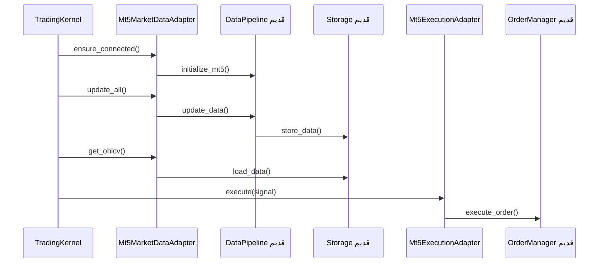

# فاز ۲ — گام ۱: اتصال MT5 (داده + سفارش)

## هدف

وصل کردن **هسته جدید** به کدهای آماده پروژه قدیم، بدون بازنویسی `DataPipeline` و `OrderManager`.

| قابلیت | فایل قدیم | آداپتر جدید |
|--------|-----------|-------------|
| دریافت/ذخیره داده | `core/data_pipeline.py` + `core/storage.py` | `Mt5MarketDataAdapter` |
| ثبت سفارش | `core/order_manager.py` | `Mt5ExecutionAdapter` |
| اتصال MT5 | `DataPipeline.initialize_mt5()` | `ensure_connected()` |
| config | `core/config.py` + `config/live_config.py` | `load_legacy_config()` |

---

## فایل‌های جدید

```
tradingbot/adapters/
├── legacy_loader.py      # مسیر پروژه قدیم + load_legacy_config()
├── timeframes.py         # M5 ↔ 5m
├── symbols.py            # EURUSD → EURUSD_i
├── mt5_market_data.py    # IMarketDataProvider
└── mt5_execution.py      # IOrderExecutor

tradingbot/config/legacy_settings.py   # KernelSettings از config قدیم
scripts/test_mt5_step1.py            # تست فقط اتصال + داده
```

---

## نحوه اجرا

### ۱) تست اتصال و داده (پیشنهادی)

```powershell
cd "c:\Users\AMIR\Desktop\TradingBot new"
python scripts/test_mt5_step1.py
```

خروجی موفق: `OK: MT5 connected` و `OK: loaded N bars`

### ۲) یک چرخه کامل هسته (dry-run — بدون سفارش واقعی)

```powershell
python -m tradingbot --live
```

متغیر `TRADINGBOT_DRY_RUN=1` باعث می‌شود آداپتر اجرا سفارش نفرستد.

### ۳) چرخه با سفارش واقعی (خطرناک)

```powershell
python -m tradingbot --live --execute
```

فقط وقتی MT5 باز است و می‌خواهی واقعاً معامله کنی.

---

## پیش‌نیازها

1. **MetaTrader 5** نصب و لاگین روی همان ویندوز
2. نصب وابستگی‌ها: `pip install -r requirements.txt`

> پروژه مستقل است؛ کل منطق در پکیج `engine/` همین پوشه قرار دارد و نیازی به پروژه‌ی قدیم نیست.

### اعتبار MT5 (اختیاری — امن‌تر از فایل config)

```powershell
$env:MT5_LOGIN = "12345678"
$env:MT5_PASSWORD = "your_password"
$env:MT5_SERVER = "Broker-Server-Name"
```

اگر set نکنی، از `config/live_config.py` پروژه قدیم خوانده می‌شود.

---

## جریان داده در هسته



---

## نکات فنی

### تایم‌فریم
- هسته جدید: `M5`, `M15`, `H4` — فقط XAUUSD
- legacy: `5m`, `1h`, ...
- تبدیل خودکار در `timeframes.py`

### نماد بروکر
- ممکن است در بروکر `EURUSD_i` باشد؛ `symbols.resolve_broker_symbol()` خودکار پیدا می‌کند.

### Trailing / Position Protector
- در این گام **نیست** — فاز بعد (`PositionProtector` thread جدا).

### استراتژی و ریسک
- هنوز **Stub** — گام ۲ و ۳ فاز ۲.

---

## عیب‌یابی

| خطا | راه‌حل |
|-----|--------|
| `MT5 connection failed` / `IPC timeout` | ترمینال MT5 را باز و لاگین کن؛ اینترنت/VPN به سرور بروکر |
| `No data file found` | parquet در `data/` همین پروژه بگذار یا با VPN داده‌ی تاریخی را دانلود کن |
| `ModuleNotFoundError: engine` | از ریشه‌ی پروژه اجرا کن (`python -m tradingbot ...`) تا `engine` روی sys.path باشد |
| `Symbol not found` | در MT5 نماد را در Market Watch فعال کن (فقط حالت live) |

---

## گام بعدی (۲)

اتصال `StrategyManager` + `priceaction` به `SignalStage` (از طریق `signal_helpers`).
