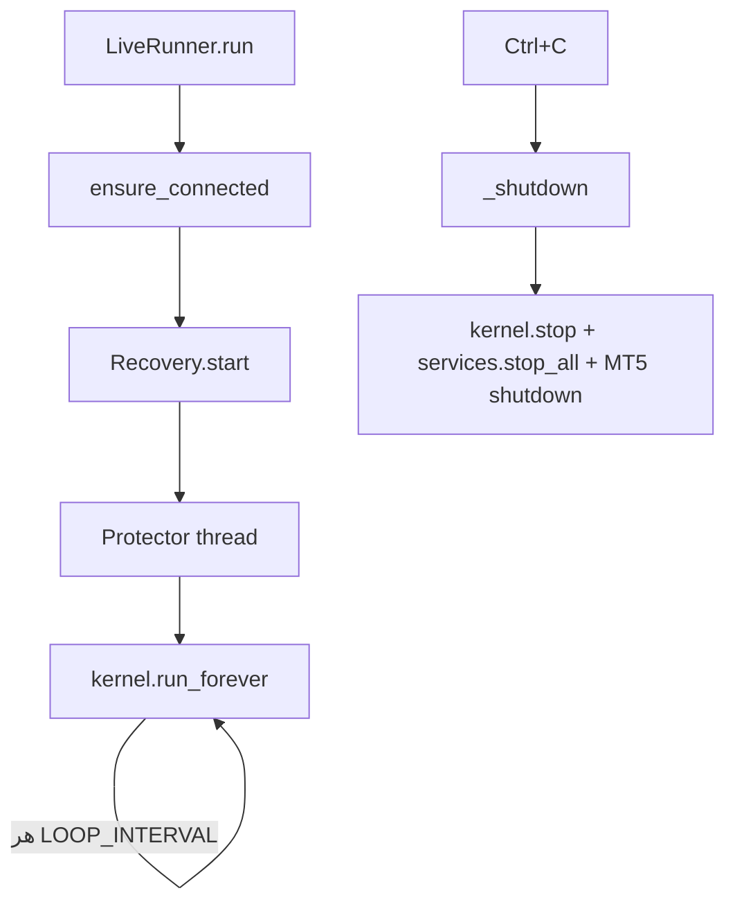

# فاز ۲ — گام ۴: حلقه دائمی Live + سرویس‌های پس‌زمینه

## هدف

جایگزین `run_system_manager.py` قدیم: ربات به‌صورت **مداوم** کار کند، سرویس‌های محافظت/بازیابی فعال شوند و **خاموشی امن** داشته باشد.

---

## اجزای جدید

| فایل | نقش |
|------|-----|
| `application/live_runner.py` | `LiveRunner` — مالک چرخه زندگی کامل |
| `adapters/legacy_background_services.py` | wrapper روی `PositionProtector` + `PositionRecoveryService` |

---

## چرخه زندگی LiveRunner

```
1. اتصال MT5 (ensure_connected)
2. شروع PositionRecoveryService  (بازیابی پوزیشن‌های قبل از restart)
3. شروع PositionProtector (thread جدا — trailing stop مستقل)
4. kernel.run_forever()  → چرخه‌های پی‌درپی با فاصله LOOP_INTERVAL
5. Ctrl+C → توقف امن: stop services + shutdown MT5
```



---

## اجرا با Watchdog (پیشنهادی)

```powershell
python scripts/run_live_watchdog.py --execute
```

یا `RUN_DASHBOARD.bat` — ری‌استارت خودکار ۵ دقیقه بعد از کرش.  
توقف: `start\5_stop_bot.bat` یا `scripts\stop_live_daemon.ps1` (فلگ `manual_stop`).

## اجرا مستقیم (بدون watchdog)

```powershell
cd "c:\Users\AMIR\Desktop\TradingBot new"
python -m tradingbot --loop
```

### Paper mode (تیک واقعی + journal، بدون سفارش بروکر)

```powershell
python -m tradingbot --loop --paper
```

### مانیتورینگ (ژوئن ۲۰۲۶)

- `TradeJournal` → `data/trade_journal.db` (executions + cycle_events)
- `Notifier` → `logs/alerts.log` + Telegram (`TELEGRAM_BOT_TOKEN`, `TELEGRAM_CHAT_ID`)
- `mt5_health.check_mt5_health` — قبل از هر چرخه در `TradingKernel`
- `KillSwitchService` — اعلان critical هنگام trigger

### حلقه دائمی با سفارش واقعی

```powershell
python -m tradingbot --loop --execute
```

### گزینه‌ها

| فلگ | اثر |
|-----|-----|
| `--execute` | اجازه سفارش واقعی (پیش‌فرض: dry-run) |
| `--no-protector` | غیرفعال کردن PositionProtector |
| `--no-recovery` | غیرفعال کردن PositionRecoveryService |

**توقف:** `Ctrl+C` — توقف امن خودکار (بستن سرویس‌ها و MT5).

---

## نتایج تست (با MT5 واقعی)

- اتصال MT5: موفق (`MT5 connected (attempt 1)`)
- Recovery + Protector: فعال
- چرخه‌های پی‌درپی: تأیید شد (چرخه ۱ → صبر ۶۰ ثانیه → چرخه ۲)
- *(نتیجهٔ تاریخی فاز ۲)* pipeline روی چند نماد×چند TF اجرا شد — **وضعیت فعلی live پیش‌فرض فقط M5** است (`get_live_config()` وقتی router روشن است؛ به‌روزرسانی 2026-09-10)
- همبستگی برای Hedging: ۶ جفت محاسبه شد *(legacy test note؛ Hedging در مسیر live فعلی قفل PA نیست)*

---

## رفع باگ مهم در پروژه قدیم

`DataPipeline._test_mt5_connection` از `hasattr(rates[0], 'time')` استفاده می‌کرد که برای رکورد `numpy.void` **همیشه False** است → تست اتصال همیشه شکست می‌خورد.

راه‌حل: آداپتر `Mt5MarketDataAdapter.ensure_connected` اتصال را **مستقل و قوی** انجام می‌دهد (init + `symbol_select`)، بدون تکیه بر تست باگ‌دار. همچنین `test_symbol` خودکار از نمادهای واقعی بروکر (مثل `EURUSD_i`) تنظیم می‌شود.

---

## وضعیت فاز ۲

| گام | وضعیت |
|-----|--------|
| ۱ — اتصال MT5 (داده + سفارش) | ✅ |
| ۲ — استراتژی (priceaction — Gold Specialist) | ✅ |
| ۳ — ریسک (RiskManager) | ✅ |
| ۴ — حلقه دائمی + سرویس‌های پس‌زمینه | ✅ |

**فاز ۲ کامل شد** — ربات live از مسیر هسته جدید کار می‌کند.
