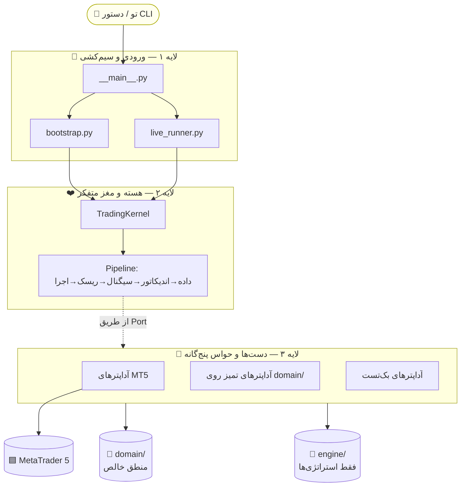
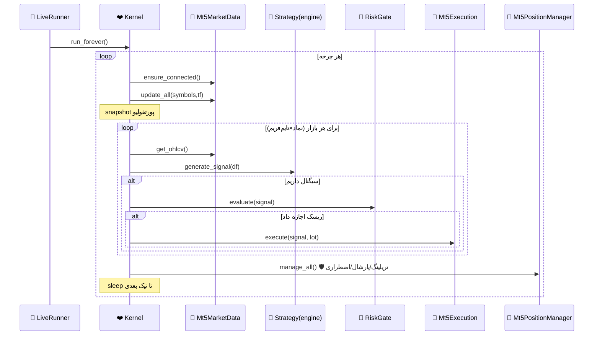
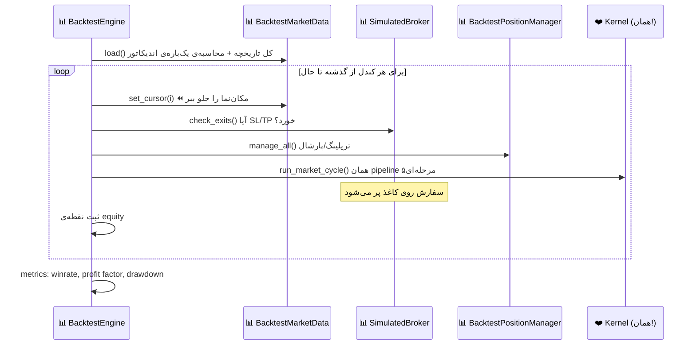
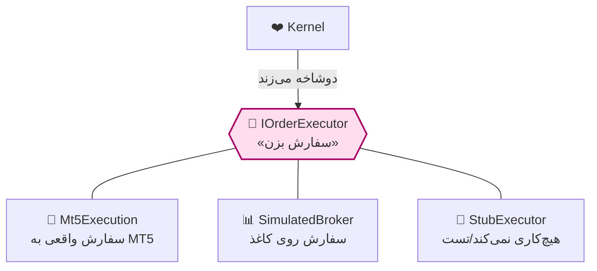
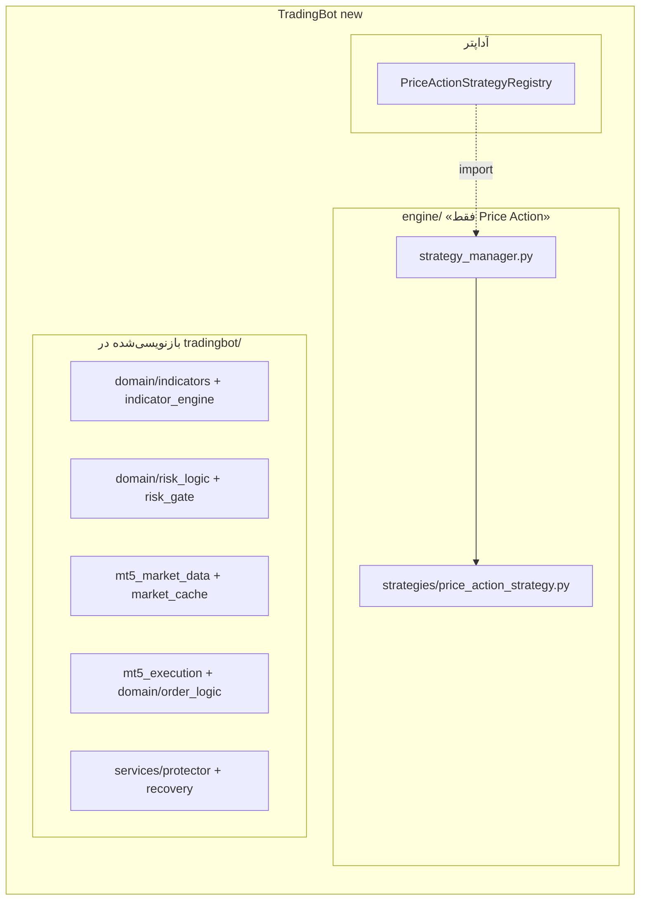
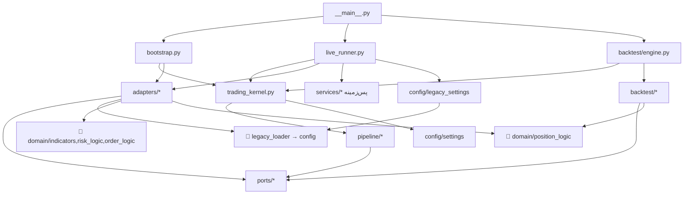
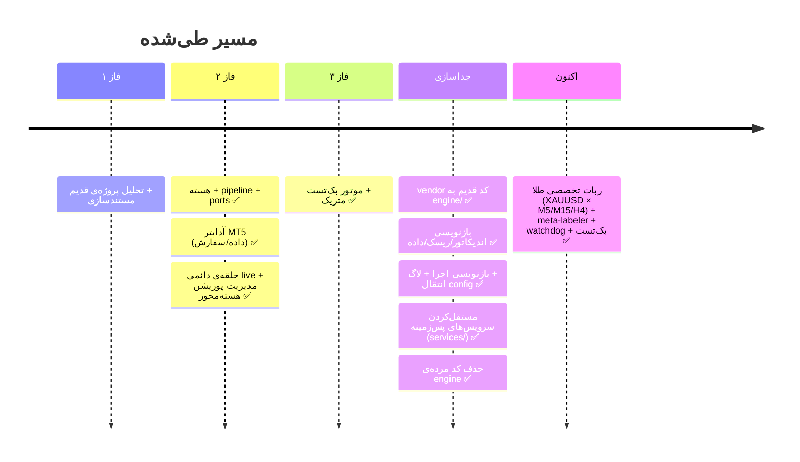
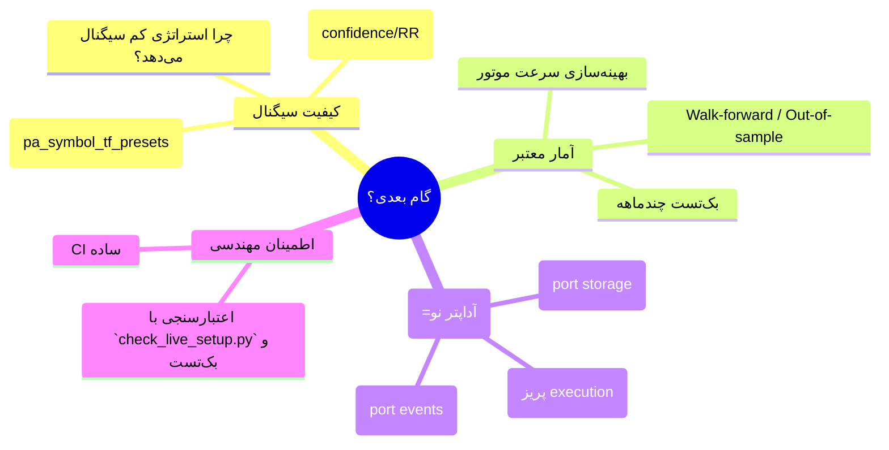

# 🧑‍🏫 تخته‌ی درس — کالبدشکافی کامل ربات

> این فایل برای **خودِ توست**. مثل وقتی معلم پای تخته همه‌چیز را می‌کشد و توضیح می‌دهد.
> هر بخش یک «تخته» است. آرام بخوان، فلش‌ها را دنبال کن، و در آخر بخش «گام‌های بعدی» با خیال
> راحت فکر کن. قرار نیست همه را حفظ کنی — قرار است **شهود** پیدا کنی.

راهنمای نمادها:
`❤️ هسته` · `📜 قرارداد(Port)` · `🔌 آداپتر` · `🧱 مدل/منطق خالص(domain)` · `⚙️ تنظیمات` · `🚪 ورودی` · `🧠 engine/ (فقط استراتژی‌ها)` · `📊 بک‌تست`

---

## تخته ۱ — کل دنیا در یک قاب

بذار اول از خیلی بالا نگاه کنیم. ربات سه «لایه» دارد و فقط یک نخِ نازک به استراتژی‌های `engine/`:



**حرف معلم:** ربات یک «مغز» دارد (هسته) که هیچ‌وقت دستش را مستقیم کثیف نمی‌کند. مغز فقط
دستور می‌دهد؛ «دست‌ها» (آداپترها) کار واقعی را انجام می‌دهند — یا با MT5، یا با منطق خالصِ
`domain/`. تنها بخشی که هنوز از پکیج `engine/` می‌آید، **خودِ استراتژی‌هاست**.

---

## تخته ۲ — درخت فایل‌ها با «نقش» هرکدام

```
tradingbot/
│
├── 🚪 __main__.py ............ نگهبان در ورودی: دستور تو را می‌خواند و به مقصد می‌فرستد
│
├── application/
│   ├── 🚪 bootstrap.py ....... کارخانه‌ی مونتاژ: قطعات را کنار هم می‌گذارد و یک kernel می‌سازد
│   └── 🚪 live_runner.py ..... راننده: kernel را در حلقه‌ی بی‌نهایت می‌راند + خاموشی امن
│
├── ❤️ kernel/trading_kernel.py  رهبر ارکستر: تنها کسی که به همه فرمان می‌دهد
│
├── pipeline/ ................. ۵ کارگرِ خط تولید (هرکدام فقط یک کار بلدند)
│   ├── base.py .............. قالب مشترک همه‌ی کارگرها
│   ├── data_stage.py ........ کارگر۱: کندل می‌آورد
│   ├── indicator_stage.py ... کارگر۲: RSI/MACD/ATR می‌چسباند
│   ├── signal_stage.py ...... کارگر۳: از استراتژی می‌پرسد «بخرم؟ بفروشم؟»
│   ├── risk_stage.py ........ کارگر۴: نگهبان ریسک «اجازه هست؟ چقدر؟»
│   └── execution_stage.py ... کارگر۵: دکمه‌ی سفارش را می‌زند
│
├── 📜 ports/ ................. «قراردادها» — فقط می‌گویند چه کاری، نه چطور
│   ├── market_data.py ....... قرارداد منبع داده
│   ├── indicators.py ........ قرارداد اندیکاتور
│   ├── strategies.py ........ قرارداد استراتژی
│   ├── risk.py .............. قرارداد ریسک
│   ├── execution.py ......... قرارداد اجرای سفارش
│   └── position_manager.py .. قرارداد مدیریت پوزیشن
│
├── 🔌 adapters/ ............. پیاده‌سازی واقعی قراردادها
│   ├── mt5_market_data.py ........ [MT5]    داده‌ی زنده (خودکفا: copy_rates + کش)
│   ├── mt5_execution.py .......... [MT5]    سفارش زنده (خودکفا: order_send)
│   ├── mt5_position_manager.py ... [MT5]    تریلینگ/پارشال روی MT5
│   ├── indicator_engine.py ....... [domain] TechnicalIndicatorEngine
│   ├── risk_gate.py .............. [domain] RiskGate + create_risk_gate
│   ├── legacy_strategy_registry.py [engine] PriceActionStrategyRegistry
│   ├── background_services.py .... مدیریت start/stop سرویس‌های پس‌زمینه
│   ├── market_cache.py ........... کش parquet داده‌ی بازار
│   ├── mt5_utils.py .............. استخراج اعتبارنامه‌ی MT5
│   ├── legacy_loader.py ......... بارگذاری/ادغام config (مهم!)
│   ├── legacy_signal_helpers.py .. re-export از signal_helpers (سازگاری)
│   ├── symbols.py / timeframes.py  مترجم نماد/تایم‌فریم (XAUUSD → XAUUSD_i)
│   └── stubs.py .................. بدلکارها برای دمو بدون MT5
│
├── 🧱 domain/ ............... اجناس خالص (بدون I/O، قابل تست)
│   ├── models.py ............ جعبه‌ها: MarketKey, TradingSignal, CycleContext...
│   ├── enums.py ............. ثابت‌ها: BUY/SELL/HOLD, حالت‌های هسته
│   ├── 🧮 signal_helpers.py .. ★ لایه میانی: resolve_market → confidence → SL/TP → TradingSignal
│   ├── 🧮 price_action.py .... SMC: swing, BOS, FVG, setup
│   ├── 🧮 position_logic.py .. تریلینگ/پارشال (مشترک live و backtest)
│   ├── 🧮 indicators.py ...... RSI/MACD/ADX/ATR/MA/Bollinger
│   ├── 🧮 risk_logic.py ...... لات، ATR→SL، can_trade
│   ├── 🧮 order_logic.py ..... اعتبارسنجی سفارش
│   ├── 🧮 session_logic.py ... فیلتر سشن، spread
│   └── 🧮 ohlcv.py ........... نرمال‌سازی کندل
│
├── infra/logging.py ......... 🪵 لاگرِ تمیز (جایگزین لاگرِ قدیم)
│
├── services/ ................ سرویس‌های پس‌زمینه‌ی مستقل روی MT5 (thread جدا)
│   ├── kill_switch.py ............... توقف اضطراری (drawdown/ضرر روزانه)
│   ├── position_protector.py ........ محافظت/تریلینگ (پیش‌فرض خاموش)
│   └── position_recovery_service.py . بازیابی پوزیشن پس از restart (sqlite)
│
├── ⚙️ config/
│   ├── settings.py .......... KernelSettings
│   ├── strategies.py ........ فقط priceaction فعال
│   ├── price_action.py ...... پایه PA + get_price_action_config()
│   ├── pa_symbol_tf_presets.py ★ پریست per-TF طلا (M5/M15/H4)
│   ├── engine_settings.py ... config پایه
│   ├── live.py .............. config live
│   └── legacy_settings.py ... مترجم config → KernelSettings
│
└── 📊 backtest/ ............. همان هسته، ولی روی گذشته (دنیای موازی)
    ├── engine.py ............ کارگردان: kernel را کندل‌به‌کندل عقب می‌برد
    ├── data_source.py ....... آرشیودار: کندل‌های تاریخی + یک مکان‌نما (cursor)
    ├── broker.py ............ بروکر خیالی: سفارش را روی کاغذ پر می‌کند
    ├── risk.py / position_manager.py / indicators.py  نسخه‌ی بک‌تستِ portها
    ├── metrics.py ........... داور: برد/باخت، profit factor، drawdown
    └── models.py / config.py

engine/ ...................... 🧠 فقط استراتژی‌ها + پشتیبانی کوچک
├── strategy_manager.py ...... بارگذاری/اجرای استراتژی‌ها
├── strategies/ .............. price_action / base_strategy (فقط Price Action)
├── logger.py ................ لاگرِ موردنیازِ همین استراتژی‌ها
└── config.py ................ shim نازک → tradingbot.config.engine_settings
```

---

## تخته ۳ — سفر یک قطره داده تا تبدیل‌شدن به سفارش

این مهم‌ترین تخته است. ببین یک ردیف OHLCV چطور قدم‌به‌قدم «پخته» می‌شود:

```mermaid
flowchart LR
    RAW["🕯️ کندل خام<br/>open/high/low/close"]:::raw
    --> S1{{"کارگر۱<br/>DataStage"}}
    RAW2["raw_ohlcv ✅"]
    S1 --> RAW2
    --> S2{{"کارگر۲<br/>IndicatorStage"}}
    ENR["enriched_ohlcv<br/>+RSI +MACD +ATR +SMA ✅"]
    S2 --> ENR
    --> S3{{"کارگر۳<br/>SignalStage"}}
    SIG["TradingSignal<br/>BUY, conf=0.75<br/>SL, TP ✅"]
    S3 --> SIG
    --> S4{{"کارگر۴<br/>RiskStage"}}
    LOT["+ lot_size=0.02<br/>(یا رد می‌شود ❌)"]
    S4 --> LOT
    --> S5{{"کارگر۵<br/>ExecutionStage"}}
    ORD["📨 سفارش به بروکر<br/>ExecutionResult ✅"]
    S5 --> ORD

    classDef raw fill:#eef
```



**حرف معلم:** دقت کن که این یک «جعبه» (`CycleContext`) است که از کارگری به کارگر بعد می‌رود
و هرکس یک‌چیز رویش می‌چسباند. اگر یک کارگر بگوید «نه» (مثلاً سیگنالی نبود، یا ریسک رد کرد)،
خط تولید همان‌جا می‌ایستد و سراغ بازار بعدی می‌رود. هیچ‌کس از کار بقیه خبر ندارد — فقط جعبه را
تحویل می‌گیرد و پاس می‌دهد. این یعنی **تمیز و قابل‌تست**.

---

## تخته ۴ — فیلم آهسته‌ی یک «تیک» زنده (Sequence)

حالا زمان را وارد می‌کنیم. وقتی `--loop` می‌زنی، هر ۳۰–۶۰ ثانیه این اتفاق می‌افتد:



**حرف معلم:** ببین `manage_all()` **بعد** از حلقه‌ی بازارها صدا زده می‌شود — یعنی اول دنبال
فرصت ورود می‌گردیم، بعد به پوزیشن‌های بازِ موجود می‌رسیم. این ترتیب مهم است.

---

## تخته ۵ — همان فیلم، ولی در دنیای بک‌تست (موازی)

نکته‌ی هنری اینجاست: **همان `Kernel` و همان pipeline**، فقط آداپترها عوض شده‌اند و زمان را
خودمان عقب می‌بریم:



**حرف معلم:** چون هسته یکی است، هرچه در بک‌تست ببینی، در واقعیت هم همان اجرا می‌شود.
این یعنی بک‌تستِ «صادق». تنها تفاوت: منبع داده از فایل می‌آید و سفارش به‌جای MT5 روی کاغذ پر می‌شود.

---

## تخته ۶ — «معجزه‌ی» Port و Adapter (چرا اینقدر تأکید می‌کنیم؟)

یک Port مثل پریز برق دیوار است. هسته فقط دوشاخه می‌زند؛ برایش مهم نیست پشت پریز چیست:



**حرف معلم:** سه پیاده‌سازی مختلف، یک قرارداد. می‌خواهی معامله‌ی واقعی؟ آداپتر MT5. می‌خواهی
بک‌تست؟ بروکر کاغذی. می‌خواهی تست سریع؟ بدلکار. **و هسته یک خط هم تغییر نمی‌کند.**

این جدول کامل پریزها و دوشاخه‌هاست (وضعیت امروز):

| 📜 Port | 🔌 MT5 | 🧱 روی domain | 🧠 engine | 📊 backtest | 🧪 stub |
|---------|--------|---------------|-----------|-------------|---------|
| market_data | Mt5MarketData | — | — | BacktestMarketData | StubMarketData |
| indicators | — | **TechnicalIndicatorEngine** | — | Passthrough | StubIndicators |
| strategies | — | — | **PriceActionStrategyRegistry** | — | StubStrategies |
| risk | — | **RiskGate** | — | BacktestRiskGate | StubRisk |
| execution | Mt5Execution | — | — | SimulatedBroker | StubExecutor |
| position_manager | Mt5PositionManager | — | — | BacktestPositionManager | — |

> دقت کن: ستون «روی domain» یعنی آداپترهایی که حالا منطق خالصِ خودِ پروژه را اجرا می‌کنند
> (نه کد engine). تنها ستونی که هنوز به `engine/` وصل است، **strategies** است.

---

## تخته ۷ — پکیج `engine/` (چه چیزی باقی مانده)

در ابتدای بازطراحی، کل منطق قدیم به `engine/` منتقل شد. بعد بخش‌به‌بخش به ماژول‌های تمیزِ
`tradingbot/` بازنویسی شد. امروز از `engine/` فقط **Price Action** مانده است:



**حرف معلم:** کد واقعی Price Action در `engine/strategies/price_action_strategy.py` است و
`PriceActionStrategyRegistry` آن را به قرارداد (Port) وصل می‌کند. استراتژی Hedging حذف شده؛
ربات اکنون **فقط Price Action** است.

---

## تخته ۸ — نقشه‌ی «چه‌کسی چه‌کسی را صدا می‌زند»

اگر بخواهی یک تغییر بدهی، باید بدانی فلش‌ها از کجا به کجاست:



**حرف معلم:** سه نقطه‌ی ورود (`bootstrap`, `live_runner`, `backtest/engine`) همگی به یک
`Kernel` می‌رسند. تفاوتشان فقط در این است که کدام آداپترها را تزریق می‌کنند. و چیزهای مشترک:
`domain/*` (فرمول‌های خالص) و `legacy_loader` (پل config).

---

## تخته ۹ — وضعیت فعلی روی یک خط زمان



---

## 🚀 تخته ۱۰ — گام‌های بعدی (اینجا فکر کن)

حالا که کل نقشه را دیدی و جداسازی تقریباً کامل شده، اینها «درهای باز» پیش رو هستند:



پیشنهادهای مشخص برای فکرکردن:

| ایده | چرا ارزشمند است | سختی | از کجا شروع |
|------|------------------|------|-------------|
| **تغییر مسیر سیگنال** | confidence/SL/TP/filtreها در یک جا | ⭐ | `domain/signal_helpers.py` |
| **بک‌تست چندماهه + بهینه‌سازی سرعت** | آمار معنادار به‌جای چند معامله | ⭐⭐⭐ 💎 | `backtest/data_source.py` |
| **Paper trading** | معامله‌ی واقعی‌نما بدون پول واقعی — فقط یک آداپتر execution جدید | ⭐⭐ 💎 | پریز `IOrderExecutor` |
| **port storage فعال** | ذخیره‌ی معاملات/equity در دیتابیس برای تحلیل | ⭐⭐ | `ports/storage.py` (خالی است) |
| **port events فعال** | اعلان تلگرام/لاگ ساختاریافته هنگام سیگنال/سفارش | ⭐⭐ 💎 | `ports/events.py` (خالی است) |
| **اعتبارسنجی live** | چک قبل از معامله واقعی | ⭐⭐ | `check_live_setup.py` + dry-run |

**حرف آخر معلم:** سه تا از این درها (paper trading، storage، events) دقیقاً همان «معجزه‌ی پریز»
تخته ۶ هستند — یعنی بدون دست‌زدن به هسته، فقط یک آداپتر جدید پشت یک Port می‌زنی. و چون
دیگر تقریباً همه‌چیز از `engine/` مستقل شده، تغییردادن هر بخش هم امن‌تر از قبل است. هر وقت
خواستی، یکی را انتخاب کن و من نقشه‌ی دقیقش را می‌کشم.

---

### پیوست — برای مرور سریع
- معماری عمیق: `docs/ARCHITECTURE_FA.md`
- راهنمای برنامه‌نویس تازه‌وارد: `docs/ONBOARDING_FA.md`
- جزئیات بک‌تست: `docs/PHASE3_BACKTEST_FA.md`
- نقشه‌ی تطبیق قدیم↔جدید: `docs/PROCESSING_MAP.md`
