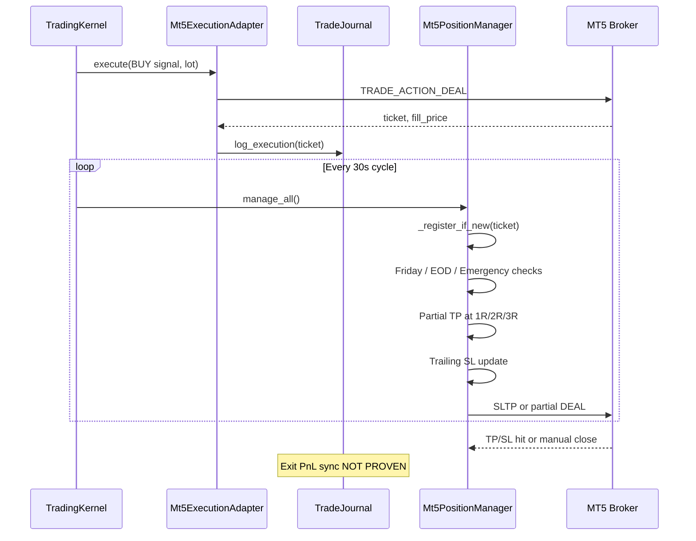

# Position Lifecycle — Open to Close

**Repository:** `TradingBot new`  
**Trace:** One BUY position from signal to final PnL storage

---

## Lifecycle Overview

```
Order Request → MT5 Send → Journal Record → Open Position Registry
    → [Partial Close | Trailing | Timeout | Friday | Emergency | TP/SL]
    → Final Close → PnL (broker + optional paper journal)
```

---

## Step 1 — Order Request

| | |
|---|---|
| **Component** | `ExecutionStage` → `Mt5ExecutionAdapter.execute()` |
| **File** | `tradingbot/pipeline/execution_stage.py`, `tradingbot/adapters/mt5_execution.py` |
| **Input** | `TradingSignal` (BUY, SL, TP, lot_size, strategy_name=ADAPTIVE_REGIME) |
| **Action** | Validates signal, resolves broker symbol (`XAUUSD` → `XAUUSD_i` etc.) |
| **Output** | Internal order request dict for MT5 |

**Touches position:** Creates new position intent — no ticket yet.

---

## Step 2 — MT5 Send

| | |
|---|---|
| **Component** | `Mt5ExecutionAdapter._place_market_order()` |
| **Function** | `_order_send_with_retry()` → `guarded_order_send()` |
| **Input** | TRADE_ACTION_DEAL, volume, BUY, price=ask, SL, TP, magic=234000 |
| **Output** | `ExecutionResult` with ticket, fill_price, slippage |
| **Failure** | Retcode ≠ DONE → no position opened |

**Guard:** `tradingbot/services/mt5_order_guard.py` — central order send wrapper.

---

## Step 3 — Journal Record (Entry)

| | |
|---|---|
| **Component** | `TradeJournal.log_execution()` |
| **File** | `tradingbot/services/trade_journal.py` |
| **Table** | `executions` |
| **Columns stored** | ts, mode, symbol, timeframe, direction, lot, requested_price, fill_price, slippage_pips, sl, tp, ticket, success, message |

**Also:** `record_live_entry(timeframe)` — cooldown tracking in live risk tracker.

**Touches same position:** ticket ID links all future events.

---

## Step 4 — Replay Accounting

| | |
|---|---|
| **Component** | Backtest engine (NOT live) |
| **File** | `tradingbot/backtest/engine.py`, `tradingbot/backtest/position_manager.py` |
| **Live equivalent** | `Mt5PositionManager._register_if_new()` |

**Live registry:** In-memory `_registry[ticket]` stores entry price, initial risk (R), partial TP state.

**Evidence:** `mt5_position_manager.py` — `_register_if_new()` called at start of `_manage_one()`.

**Replay parity:** `position_logic.py` shared between live and backtest for trailing/partial math.

---

## Step 5 — Partial Close

| | |
|---|---|
| **Component** | `Mt5PositionManager._check_partial_tp()` |
| **Logic** | `tradingbot/domain/position_logic.py` → `partial_tp_target()`, `target_hit()` |
| **Levels** | DEFAULT_PARTIAL_TP_LEVELS: (1.0R, 50%), (2.0R, 30%), (3.0R, 20%) |
| **Gate** | `partial_tp_enabled(sym, tf)` from position presets |
| **Action** | `_close_partial()` — opposite market deal, reduced volume |

**Touches same position:** Same ticket; registry tracks which R levels already taken.

---

## Step 6 — Trailing Stop

| | |
|---|---|
| **Component** | `Mt5PositionManager._apply_trailing()` |
| **Logic** | `calculate_safe_sl()`, `trailing_improves()` in `position_logic.py` |
| **Method** | ATR-based stepped trailing; SL only tightens |
| **Action** | `_update_stop_loss()` — TRADE_ACTION_SLTP |

**Frequency:** Every global cycle (~30s) via `TradingKernel._manage_positions()`.

---

## Step 7 — Timeout

| | |
|---|---|
| **Config** | `MAX_POSITION_AGE_HOURS=24` in live.py L50; `MAX_POSITION_AGE=1800` L67 |
| **Live implementation** | **NOT PROVEN** — `Mt5PositionManager` read in this audit does not show age-based close in first 120 lines; full file may contain timeout |

**Mark:** NEEDS_VERIFICATION — config keys exist; live manager `_manage_one()` order documented as: Friday → EOD → emergency → partial → trailing.

**Backtest:** May implement timeout in `BacktestPositionManager` — NOT PROVEN for live.

---

## Step 8 — Friday Close

| | |
|---|---|
| **Component** | `Mt5PositionManager._check_friday_close()` |
| **Logic** | `session_logic.should_friday_close()` |
| **Threshold** | FRIDAY_CLOSE_HOUR=20, MINUTE=0 (PRICE_ACTION preset) |
| **Action** | `_close_position(comment="FridayClose")` |

**Note:** Separate from Friday **no new entry** gate (hour 17) in RiskGate.

---

## Step 9 — Emergency Close

| | |
|---|---|
| **Component** | `Mt5PositionManager._check_emergency()` |
| **Threshold** | `emergency_max_loss_pips` — default 50.0 in constructor; live.py lists 90 (may not propagate — see dead_features) |
| **Action** | `_close_position(comment="KernelEmergencyStop")` |

**Account-level:** `KillSwitchService` stops cycles but does not mass-close positions.

---

## Step 10 — Final PnL Storage

| Close path | PnL recorded where |
|------------|-------------------|
| Broker TP/SL | MT5 deal history — **NOT automatically synced to TradeJournal on close** |
| Partial/full manager close | MT5 deal — journal `executions` has entry only |
| Paper mode | `TradeJournal.paper_trades` — full lifecycle with pnl, exit_reason |
| Cycle log | `cycle_events` — pipeline state only, not trade PnL |

**Live PnL storage gap:** `executions` table logs **entries**; automatic **exit** PnL sync to SQLite is **NOT PROVEN** in `trade_journal.py` for live MT5 closes.

**Backtest PnL:** `data/backtest_last.json` aggregates net profit, exit_reasons (sl:8, emergency:3, tp:2).

---

## Components Touching the Same Position

| Component | Role | Ticket reference |
|-----------|------|------------------|
| `Mt5ExecutionAdapter` | Open | Creates ticket |
| `TradeJournal.log_execution` | Entry audit | ticket column |
| `LiveRiskTracker` | Cooldown / daily count | After entry |
| `Mt5PositionManager._registry` | Partial/trailing state | ticket key |
| `Mt5PositionManager._resolve_timeframe()` | Reads executions.timeframe by ticket | ticket lookup |
| MT5 broker | TP/SL execution | ticket |
| `KillSwitchService` | Halt new trades | Does not track per-ticket |
| `Notifier` | Entry alert | On execute success |
| `PaperTradeRecorder` | Paper only | journal_id |

---

## End-of-Day Close

| | |
|---|---|
| **Component** | `Mt5PositionManager._check_eod_close()` |
| **Threshold** | EOD_HOUR=23, EOD_MINUTE=55 (`live.py` L71–72) |
| **Action** | Full close all open positions |

---

## Position Lifecycle Diagram



---

## Exit Reason Evidence (Backtest Parity)

From `data/backtest_last.json` (14d adaptive confluence):

| Exit reason | Count |
|-------------|-------|
| sl | 8 |
| emergency | 3 |
| tp | 2 |

Live exit reason logging to journal: **NOT PROVEN**.
